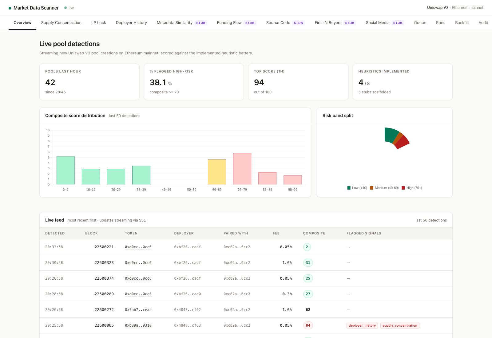

# market-data-scanner

A real-time Ethereum market surveillance system that detects newly created Uniswap V3 pools and evaluates them for potential scam or rug-pull risk. The application listens to Ethereum mainnet pool-creation events, enriches each detection with on-chain context, applies a configurable heuristic scoring pipeline, persists results to Postgres, and exposes a live dashboard for review.

This project is designed as an end-to-end risk-analysis platform for early token launches. It combines blockchain event ingestion, asynchronous Kotlin processing, persistent scoring evidence, human review workflows, and deployment-ready infrastructure.

## What it does

`market-data-scanner` monitors Uniswap V3 factory events on Ethereum mainnet and identifies new liquidity pools as they are created. For each detected pool, the system extracts the relevant token, pool, deployer, transaction, block, and paired-asset context, then evaluates the token using a composite risk model.

The scoring pipeline is built around independent heuristics that produce normalized risk scores, confidence values, and structured evidence. Implemented and planned signals include:

- **Supply concentration analysis** — evaluates holder distribution, top-holder ownership, and Gini-style concentration risk.
- **LP lock analysis** — inspects early liquidity behavior to identify deployer-held, burned, locked, or unknown liquidity positions.
- **Deployer history analysis** — evaluates whether the token deployer has a suspicious history of short-lived or abandoned token launches.
- **Metadata similarity analysis** — planned pgvector-backed comparison against a trusted-token corpus for impersonation-style risk detection.
- **Composite risk scoring** — combines individual heuristic outputs into a single risk score suitable for dashboard triage.

The result is a live feed of newly launched pools with explainable evidence behind each score.

## Why I built it

New token launches on decentralized exchanges are high-volume, time-sensitive, and difficult to evaluate manually. Many scam tokens rely on short launch windows, concentrated supply, misleading metadata, or repeat deployer behavior. This project explores how automated chain monitoring and evidence-based heuristics can help surface suspicious launches quickly enough for human review.

The goal was to build something closer to a production surveillance pipeline than a static data-analysis script:

- real-time Ethereum event ingestion
- resumable historical backfills
- structured persistence
- modular heuristic scoring
- dashboard and admin workflows
- observability and deployment support

## Tech stack

- **Kotlin 2.3**
- **Java 17**
- **Spring Boot**
- **web3j** for Ethereum RPC/WebSocket integration
- **Postgres** with **pgvector**
- **Flyway** for schema migrations
- **Spring Data JPA**
- **Spring AI** for embedding-based workflows
- **Caffeine** for caching
- **Resilience4j** for fault tolerance
- **Micrometer / Actuator / Prometheus** for observability
- **Thymeleaf + htmx** for the dashboard
- **Docker / Docker Compose**
- **Fly.io** deployment configuration

## Architecture overview

The system is organized around a few core components:

1. **Block sources**
    - Live mode subscribes to Ethereum mainnet events.
    - Backfill mode replays historical block ranges.
    - Both modes emit normalized token/pool detection events into the same ingestion pipeline.

2. **Ingestion pipeline**
    - Consumes detections from live or historical sources.
    - Handles idempotency and processed-block tracking.
    - Runs the risk-scoring pipeline.
    - Persists detections, evidence, and ingestion-run metadata.

3. **Heuristic scoring engine**
    - Runs independent risk heuristics.
    - Captures each heuristic's score, confidence, evidence, version, and input hash.
    - Produces a weighted composite score for triage.

4. **Persistence layer**
    - Stores pool detections, processed blocks, ingestion runs, review decisions, and corpus entries.
    - Uses Postgres JSONB for flexible heuristic evidence.
    - Uses pgvector for future embedding-based token metadata similarity.

5. **Dashboard and admin tools**
    - Live overview of detected pools.
    - Per-heuristic detail views.
    - Review queue for human labeling.
    - Backfill controls and ingestion status pages.

## Key features

- Real-time Uniswap V3 pool detection from Ethereum mainnet
- Historical block backfill support
- Modular heuristic framework for explainable risk scoring
- Persistent evidence storage for each pool and heuristic
- Dashboard for live monitoring and investigation
- Admin review workflow for labeling suspicious or legitimate tokens
- pgvector-backed architecture for future token metadata similarity detection
- Prometheus-compatible observability endpoints
- Dockerized local development environment
- Fly.io deployment configuration

## Quick start
